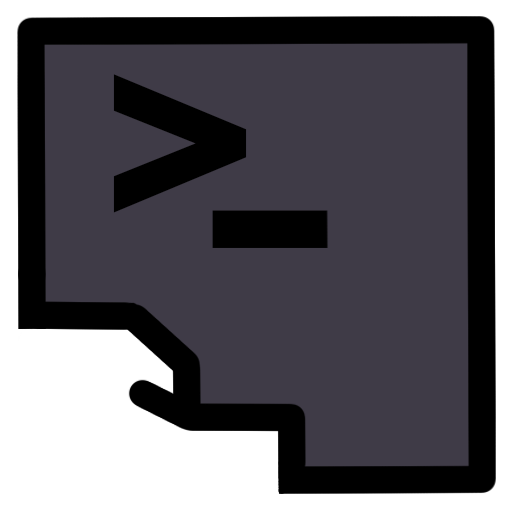
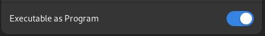

# `esase`: Easy Setup And System Enhancement (Popup based Linux Bash script/tool)

<p align="center">
  <a href="https://github.com/fuchs-fabian/esase/blob/main/config">
    
  </a>
  <a href="https://github.com/fuchs-fabian/esase/blob/main/install-esase.sh">
    
  </a>
  <a href="https://github.com/fuchs-fabian/esase/blob/main/uninstall-esase.sh">
    
  </a>
  <a href="https://github.com/fuchs-fabian/esase/blob/main/LICENSE">
    
  </a>
</p>

<h3 align="center">
	<br/>
	esase
</h3>

## Description

### What is `esase`?

`esase` is a popup-based Linux Bash script (tool) designed for installing, uninstalling and managing system apps/packages/package managers...

> It doesn't matter which Linux distribution you use. Well almost, they have to be supported by `esase`.\
> It automatically detects the distribution/system in use and executes the necessary commands based on that information.

The use of popups is optional and is only enabled with the `-g` flag.\
Without the `-g` flag, the script operates in console mode.

### What makes it special?

**It's simple**: You don't need expert knowledge to set up your Linux desktop. While app stores exist, manual setup and waiting are still required...\
`esase` works across various distributions, and the app file configurations and `config.json` can be easily transferred to another Linux distribution to achieve the same setup.

**Reasoning**: `esase` is written in Bash, which is commonly available on most Linux distributions without any issues. This makes it highly minimalistic in terms of interactions, and it requires very little computational power to perform its functions.

For example, it is currently designed to use the same configuration files to set up identical environments on different Linux distributions without needing to run multiple commands.

**It only requires a few packages**: `pkexec`, `jq`, `yad`, `xrandr`

**Secure default**: Nothing is executed completely with `sudo`. You are always asked beforehand so that nothing serious can happen.

### Who is it for?

`esase` is perfect for individuals who...

- ... have basic Linux knowledge.
- ... are switching from Windows to Linux and want to minimize console usage to configure the system as desired.
- ... use multiple different Linux distributions simultaneously.
- ... want a clean Linux installation and wish to set up various things without extensive googling.
- ... frequently set up different Linux VMs and want to try out distributions without creating complex scripts or having advanced knowledge.
- ... want to help family members quickly set up their systems with preferred applications, making it easy to show them what is being done. The tool's usage can be summarized on a cheat sheet, allowing newcomers to use it independently without needing extensive notes.

### The Goal of the `esase` Project

The aim of `esase` is to highlight the challenges of switching between Linux desktop environments. While there are solutions that simplify this process, and while it is easier to stick to a single distribution, there are key points to consider:

- It should be easier, especially for beginners.
- It should save time and eliminate the need for extensive learning just to use a system.
- Should minimise the need to create your own bash scripts to manage apps and co. Would you rather have a well thought-out tool that has the functionality than unsafe custom bash scripts?
- One should not need to be an IT professional to use Linux as a daily operating system.
- The effort required to perform tasks in the console should be minimized. But efficiently, as if you were doing it in the console.

> Everyone has their own preferences, and those should be respected. However, perhaps this project can help make it easier to attract more people to Linux?

## ⚠️ **Disclaimer - Important!**

This tool is at a very early stage of development. Bugs may be present. If you find a bug, please create an issue or a pull request.

It is a Bash script that can have a strong impact on the system. It is therefore particularly important that you check what happens in the `.sh` files before you use it.

> Only do it if you know roughly what is going to happen.

`esase` currently only supports the following Linux desktop distributions:

| Distribution | Minimum Version | Supported Desktop Environment | Status Information |
| ------------ | --------------- | ----------------------------- | ------------------ |
| Ubuntu       | 24              | GNOME                         | Very little tested |
| Debian       | 12              | GNOME                         | Not yet tested     |
| Fedora       | 40              | GNOME                         | Extensively tested |

| Supported languages | Short |
| ------------------- | ----- |
| English             | `en`  |
| German              | `de`  |

### Known issues

- App categories may not contain spaces or hyphens. Only `_` and upper and lower case is allowed.
- In some cases, individual interactions in the console/terminal are still necessary. However, this has been reduced to a minimum.

## Getting Started

### Installation

Clone the repository or download the corresponding release and execute the script [`install-esase.sh`](https://github.com/fuchs-fabian/esase/blob/main/install-esase.sh).

You must first make this script executable!

Right-click on the script and then on Properties:



Or alternatively in the console:

```bash
chmod +x ./install-esase.sh
```

Then execute the script!

Right-click on the script and then:


Or alternatively in the console:

```bash
./install-esase.sh
```

> An app icon will then also appear in your app menu. If you click on this, gui mode will be used automatically.
> You can also simply call up `esase` in the console from anywhere.

**Example**:

```bash
esase -h
```

### Use without installation

No problem, just make the script `esase.sh` executable and start it.

- Then no app icon will be created in your app menu.
- No "critical" or "unwanted" changes are made to the file system.

**Disadvantage**: You have to start it via the console and you need to know the exact path of `esase.sh`.

## Reinstall with own configuration files

If you have already installed the tool and have your configuration files from the last uninstall or have any in general, you must enter or replace them in the project's folder structure in the `config` folder before you execute the install script.

These files will then be used during installation.

Alternatively, you can move the files to the corresponding location that the tool gives you at startup.

Make sure that the `json` files do not contain any errors that could lead to a problem when executing `esase`. Use the GUI for the app files to edit these files so that serious errors are excluded.

## Usage

```plain
Usage: esase [-h] [-g] [-d] [-c CONFIG_FILE] [-l LANGUAGE] [-i "PACKAGE_1 PACKAGE_2 ..."] [-u] [-r "PACKAGE_1 PACKAGE_2 ..."]
  -h                      Show help
  -d                      Enables debug logging
  -g                      Use GUI
  -c CONFIG_FILE          Specify a custom configuration file to run actions automatically
                          (Default: /var/lib/esase/config/config.json; Ignored if "-i", "-u" or "-r" is selected)
  -l LANGUAGE             Specify language
                          (en or de; Default: System language)
  -i PACKAGES_TO_INSTALL  Specify packages to install
                          (only used if "-g" was not selected)
  -u                      Updates all - packages, flatpaks, npm, etc.
                          (only used if "-g" was not selected)
  -r PACKAGES_TO_REMOVE   Specify packages to remove
                          (only used if "-g" was not selected)
```

### Example configuration (`config.json`) for config mode (`-g` was not selected)

```json
{
  "update_all": false,
  "remove": [
    "firefox",
    "totem",
    "rhythmbox",
    "eog",
    "cheese",
    "gnome-tour",
    "gnome-photos",
    "gnome-user-docs",
    "gnome-contacts",
    "gnome-weather",
    "gnome-maps"
  ],
  "replace_terminal": true,
  "install_apps": true,
  "install_flatpak_apps": true,
  "install_advanced_virtualization": false,
  "install_docker": true,
  "install_npm": false
}
```

## Uninstallation

Execute the script [`uninstall-esase.sh`](https://github.com/fuchs-fabian/esase/blob/main/uninstall-esase.sh).

Note that this script must be made executable beforehand. The procedure is very similar to the installation.

And because it is so similar to the installation, you can simply make the install-esase.sh script executable and then simply:

```bash
./install-esase.sh undo
```

> When uninstalling, the configuration files are automatically copied to the current home directory so that you can reuse them. The path where you can find it will be indicated.

## Bugs, Suggestions, Feedback, and Needed Support

> If you have any bugs, suggestions or feedback, feel free to create an issue describing what you'd like to see.

Current considerations and potential improvements:

- Integrate `esase` into Bash package managers.
- Export and import of configurations while the app is installed (GUI and console).
- Automatically detect Microsoft Windows applications and generate a configuration with Linux equivalents.
- Support additional Linux distributions.
- Support more languages for the popups.
- Provide log outputs in multiple languages.
- Support for Linux server.

In general, `TODO`s are included in the code, which would otherwise be possible.

To achieve a stable version and an established tool, implementing some of these ideas is crucial, especially the package manager integration. Since this project has been developed single-handedly so far, it would be greatly appreciated if volunteers could join and contribute! 😊

### Contact

If you have general questions, suggestions, etc. and don't want it to be an issue, you can reach me at Matrix (https://app.element.io):

**Invitation link**: [esase (Matrix Space)](https://matrix.to/#/#esase:matrix.org)

If you would like to take part and don't know how or what to do, you are welcome to write to me.\
There are German and English rooms there. 😊

## Donate with [PayPal](https://www.paypal.com/donate/?hosted_button_id=4G9X8TDNYYNKG)

If you think this tool is useful and saves you a lot of work and nerves and lets you sleep better, then a small donation would be very nice.

[](https://www.paypal.com/donate/?hosted_button_id=4G9X8TDNYYNKG)
